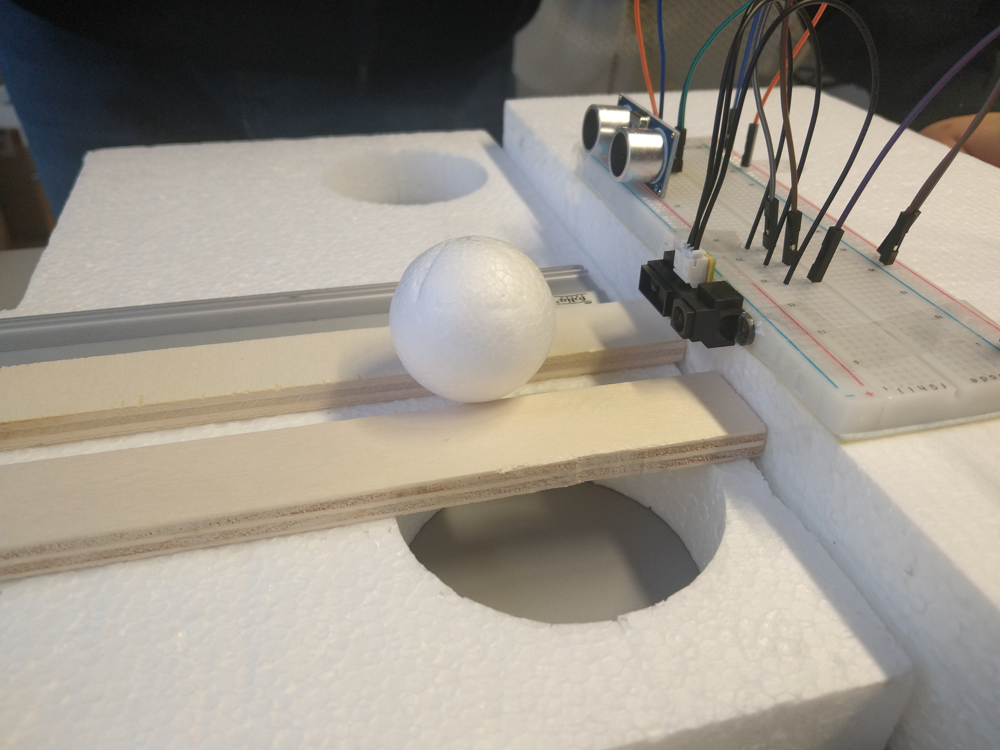

# Projektdokumentation

- [Projektdokumentation](#projektdokumentation)
  - [Datenblätter](#datenblätter)
  - [Aufgaben](#aufgaben)
  - [Projektverlauf](#projektverlauf)
    - [Stunde 1 (2021-12-14)](#stunde-1-2021-12-14)
    - [Stunde 2 (2021-12-15)](#stunde-2-2021-12-15)
    - [Stunde 3 (2022-01-11)](#stunde-3-2022-01-11)
    - [Stunde 4 (2022-01-12)](#stunde-4-2022-01-12)
    - [Stunde 5 (2022-01-18)](#stunde-5-2022-01-18)
    - [Stunde 6 (2022-02-01)](#stunde-6-2022-02-01)
    - [Stunde 7 (2022-02-08)](#stunde-7-2022-02-08)
    - [Stunde 8 (2022-02-22)](#stunde-8-2022-02-22)
  - [Teileauswahl](#teileauswahl)
    - [Servomotor](#servomotor)
    - [Abstandssensor](#abstandssensor)
      - [**Mit Brett**](#mit-brett)
      - [**Mit Ball (3,9 cm Durchmesser / kleiner Ball)**](#mit-ball-39-cm-durchmesser--kleiner-ball)
      - [**Ergebnis**](#ergebnis)
  - [Aufbau & Funktion der Bauteile](#aufbau--funktion-der-bauteile)

## Datenblätter
- [Lichtsensor](https://www.farnell.com/datasheets/1657845.pdf)
- [Ultraschallsensor](https://www.mikrocontroller.net/attachment/218122/HC-SR04_ultraschallmodul_beschreibung_3.pdf)

## Aufgaben
- [ ] Zeichen von Bauteilen
  - [x] [Grundplatte](../cad-files/Grundplatte.FCStd)
  - [x] [Laufschinen](../cad-files/Laufschinen.FCStd)
  - [x] [Standbeine](../cad-files/Standbeine.FCStd)
  - [x] [Ball](../cad-files/Ball_klein.FCStd)
  - [x] [Fuß](../cad-files/Fuss.FCStd)
  - [x] [Motorhalter](../cad-files/Motorhalterung.FCStd)
  - [x] [Achse](../cad-files/Achse.FCStd)
  - [x] [Lager](../cad-files/Lager.FCStd)
  - [x] [Endstück](../cad-files/Endplatte.FCStd) (links/rechts)
  - [x] Schrauben
- [x] Zusammensetzen
- [x] Berechnung und Argumentation Motorbestimmung

## Projektverlauf

### Stunde 1 (2021-12-14)

- erste Überlegungen und grobe Planungsskizzen

### Stunde 2 (2021-12-15)

- weitere Arbeit an Planungsskizzen
- Programierung Testskript
- Aufbau Sensortest

### Stunde 3 (2022-01-11)
1. Testen der verschiedenen Abstandssensoren
2. Arduino macht Probleme beim Hochladen (Hochladen nicht möglich)
    - Problem war, dass der Lichtsensor auf dem Digitalport 1 angeschlossen war (Inteferentz mit Serieller Kommunikation)
3. Problem behoben
4. [Testreihe](#sensor-tests) aufgenommen

### Stunde 4 (2022-01-12)
1. Zeichnen von Bauteilen
   - [Grundplatte](../cad-files/Grundplatte.FCStd)
   - [Laufschinen](../cad-files/Laufschinen.FCStd)
   - [Standbeine](../cad-files/Standbeine.FCStd)
   - [Ball](../cad-files/Ball_klein.FCStd)
   - [Fuß](../cad-files/Fuss.FCStd)

2. Zusammensetzen begonnen

### Stunde 5 (2022-01-18)
Info: Nur eine Stunde wegen GFS

1. Zeichen von Bauteilen
2. Zusammensetzen von Teilen

### Stunde 6 (2022-02-01)
Info: Nur Jan anwesend (Krankheit)

Weiterzeichen an [Lager](../cad-files/Lager.FCStd) und [Gesamtkonstruktion](../cad-files/Wippe_gesamt.FCStd)

### Stunde 7 (2022-02-08)
Beim Einfügen von [Endplatte](../cad-files/Endplatte.FCStd) und [Lager](../cad-files/Lager.FCStd) zur [Gesamtkonstruktion](../cad-files/Wippe_gesamt.FCStd) fallen nicht
übereinstimmende Maße auf ⇒ [Endplatte](../cad-files/Endplatte.FCStd) muss neu gezeichnet werden, da FreeCAD
durcheinanderkommt.

### Stunde 8 (2022-02-22)
- Dokumentation

## Teileauswahl

### Servomotor

Anforderungen (Berechnung siehe [Notizzettel](Notes.pdf) Seite 7):
- Minimale Kraft: 0,6055 Nm
- Minimale Geschwindigkeit: 115,8 °/s
- Maximalpreis: 10€

Die Grundidee bei der Bestimmung der Anforderungen an den Motor lautet wiefolgt:

Angenommen, die Wippe ist voll ausgelenkt (+20°) nach rechts. In der Zeit, in der der Ball auf der Wippe ganz nach rechts rollt, muss der Motor die Wippe in die andere Extremposition (-20°) bringen. Dafür benötigt er sowohl genügend Drehmoment, als auch eine minimale Drehgeschwindigkeit. Diese Werte sind im oben genannten [Notizzettel](Notes.pdf) auf Seite 7/8 berechnet.

Möglich wären beispielsweise diese Motoren: 
- [JAMARA 033215 Servo Q7 Standard](https://www.reichelt.de/servo-q7-standard-jamara-033215-p238317.html?&trstct=pol_5&nbc=1)
- [MASTER DS4020 Standardservo, 6 Kg, Digital](https://www.reichelt.de/standardservo-6-kg-digital-master-ds4020-p226367.html?&trstct=pol_6&nbc=1)

Die Motorhalterung wurde für den 360°-Servo in der Schule designed und muss entsprechend der Motorauswahl angepasst werden. Das ist auch der Grund, warum keine Zeichnungen von der Motorhalterung exestieren, da diese nicht sinnvoll wären.

### Abstandssensor

Testen von verschiedenen Abstandssensoren. Einmal einen Ultraschallsensor (Typ: `HC-SR04`) und einen optischen Abstandsensor (Typ: `GP2Y0A21YK0F`). Die beiden Sensoren

Um wie gefordert zu funktionieren benötigt die Wippe eine Möglichkeit, die Position des Balls einigermaßen genau zu beobachten. Dafür sind spezielle Sensoren vonnöten. Da auch die Forderung besteht, möglichst mit vorhandenen Bauteilen zu arbeiten, kam für uns zunächst der Ultraschallsensor in Betracht. Da aber Zweifel bezüglich der Genauigkeit bei einem kleinen Ball bestanden, haben wir uns für eine Testreihe entschieden, die die Entscheidung Ultraschall- und Licht(Infrarot-)sensor fällen sollte.

Für die beiden folgenden Tests wurden die Messwerte der beiden Sensoren mit [diesem Skript](../testing/sensor-testing/compare-sensors/compare-sensors.ino) erfasst.

#### **Mit Brett**

Zunächst wurde die generelle Genauigkeit getestet, indem ein großes Styroporbrett vor die Sensoren gehalten, und die Messwerte der Sensoren mit dem Abstand des Bretts notiert wurden.

Der Lichtsensor steht 1,3 cm über, dass heißt, 1,3 cm müssen auf die gemessen Werte addiert werden.  Werte in cm.

| Abstand (Brett) | Schallsensor | Lichtsensor |
--- | --- | --- |
| 5 | 5 | 8|
| 10 | 11 | 10 |
| 15 | 16 | 15 |
| 20 | 20 | 21 |
| 25 | 26 | 27 |
| 30 | 30 | 34 |
| 35 | 34 | 39 |

Hier ist der Schallsensor etwas genauer als der Lichtsensor.

#### **Mit Ball (3,9 cm Durchmesser / kleiner Ball)**

Um die Genauigkeit im eigentlichen Anwendungsfall zu ermitteln wurde eine weitere Messreihe, diesmal mit einem kleinen Styroporball aufgenommen.

| Abstand (Ball) | Schallsensor | Lichtsensor |
--- | --- | --- |
| 5 | 5| 9
| 10 | 15| 9
| 15 | 176 | 15
| 20 | 176| 21
| 25 | 176| 27
| 30 | 177| 33
| 35 | 177| 39

#### **Ergebnis**

Wir verwenden den Lichtsensor, da der Schallsensor ab 15 Zentimetern den Ball nicht mehr erkennt, erkennbar an dem deutlichen Sprung zu 177 cm.

## Aufbau & Funktion der Bauteile

Die Ballwippe besteht aus insgesamt 8 Bauteilen.

Der Standfuß steht auf einer Grundplatte und dient zur Stabilisierung der Ballwippe. Er festigt die zwei Standbeine, auf welchen das Lager liegt. Zwischen den beiden Balken wird die Kabelführung für Motor und Sensoren gelegt. Die beiden Standfüße sind ein weiteres Bauteil, das zur Stabilisation dient. Sie halten das Lager, welches durch den Motor gedreht wird. Auf dem Lager wird die Laufschiene der Wippe platziert. An den Enden der Laufschiene sind Abstandssensoren, die die Entfernung zum Boden messen. Durch die Drehachse, die waagrecht durch das Lager läuft, kann der Motor, welcher in einer Einkerbung an der rechten Seite des Lagers befestigt wird, die Drehung des Lagers und somit die Neigung der Wippe kontrollieren. Der Motor wird von einer Motorhalterung gehalten, welche mit zwei Schrauben an den Standfüßen befestigt wird.
